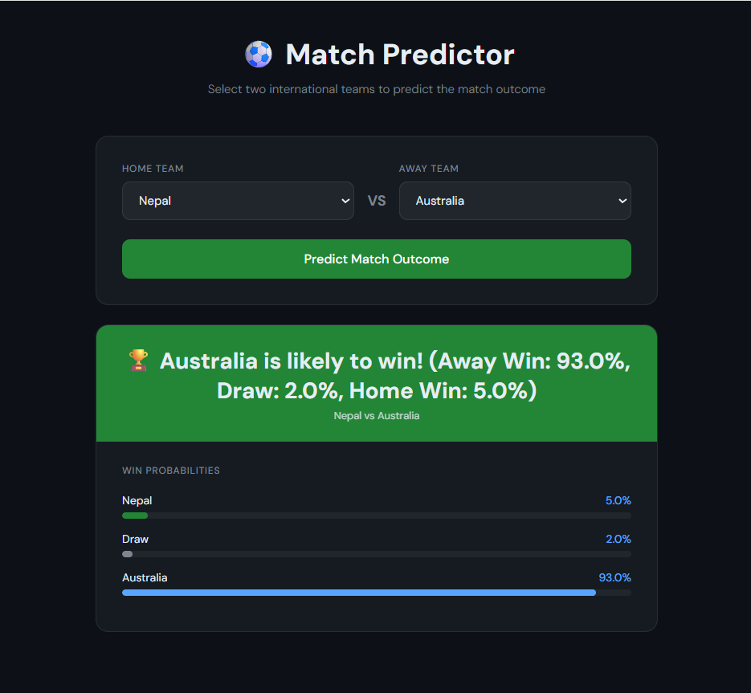

# ⚽ Football Match Predictor

An AI-powered web app that predicts international football 
match outcomes using Machine Learning and 49,287 historical matches.

## 🖥️ Demo


## ⚙️ How It Works
1. Select home and away teams from 333 international teams
2. AI calculates team strength based on historical stats
3. Random Forest model predicts the outcome
4. See win probabilities for all three outcomes visually

## 🛠️ Technologies Used
- Python & Django (Backend)
- Scikit-learn Random Forest (ML Model)
- Pandas & NumPy (Data Processing)
- 49,287 historical international matches (Dataset)

## 🧠 ML Concepts Used
- Feature Engineering (win rate, avg goals scored/conceded)
- Random Forest Classifier (100 decision trees)
- Probability Prediction with predict_proba
- Model Persistence with Pickle

## 📊 Model Performance
- Accuracy: 52.9%
- Baseline random guessing: 33.3%
- Improvement over baseline: +19.6%

## 🚀 How to Run Locally

### Step 1 — Clone the repository
```bash
git clone https://github.com/Srijannsm/football-match-prediction.git
cd football-match-prediction
```

### Step 2 — Create and activate virtual environment
```bash
python -m venv venv
venv\Scripts\activate
```

### Step 3 — Install dependencies
```bash
pip install -r requirements.txt
```

### Step 4 — Generate the Model Files
The trained model files are not included in this repository 
due to GitHub's file size limits. Follow these steps to generate them:

1. Download the dataset from Kaggle:
   https://www.kaggle.com/datasets/martj42/international-football-results-from-1872-to-2017
   
2. Open Google Colab: https://colab.research.google.com

3. Upload `results.csv` to Colab using the files panel on the left

4. Run all cells in the notebook (i.e football-match-predictor.ipynb)

5. Download `football_model.pkl` and `team_stats.pkl` from 
   the Colab files panel on the left sidebar

6. Place both files in the root of this project folder

### Step 5 — Run the server
```bash
python manage.py migrate
python manage.py runserver
```

### Step 6 — Open in browser
http://127.0.0.1:8000

## 👤 Author
Srijan Pradhan
GitHub: github.com/Srijannsm